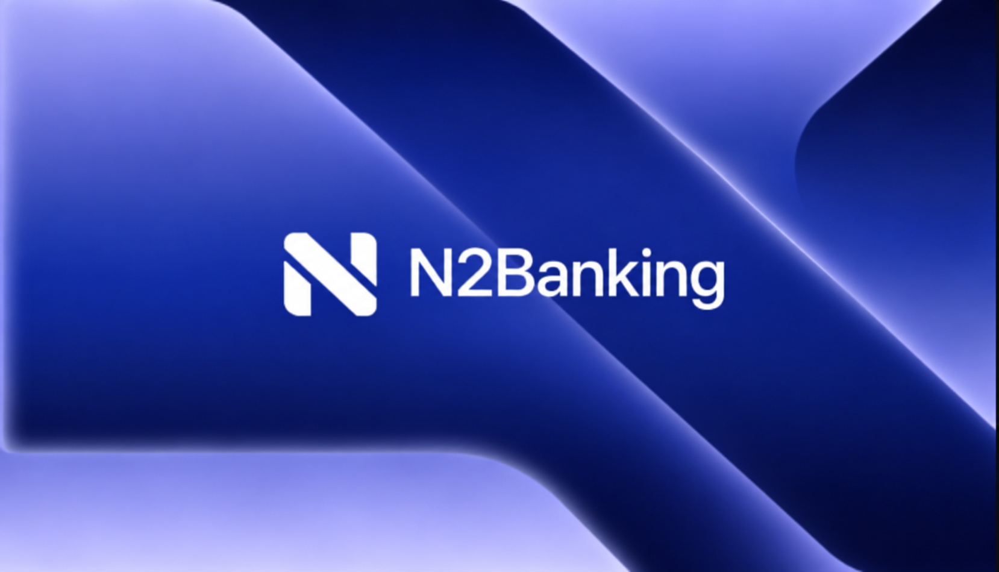
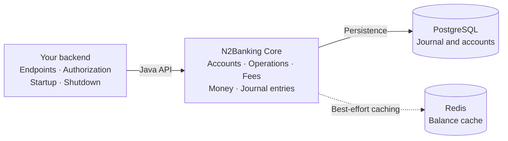

<p align="center">
  
</p>

<h1 align="center">N2Banking Core</h1>
<p align="center"><strong>Banking operations. Balanced entries. Explicit rules.</strong><br />
A Java library for banking operations and double-entry accounting.</p>
<p align="center"><code>Java 25</code> · <code>PostgreSQL</code> · <code>Redis</code> · <code>0.1.0-SNAPSHOT</code></p>
<p align="center">
  <a href="docs/GETTING_STARTED.md">Get started</a> ·
  <a href="docs/examples/LibraryExample.java">Explore the example</a> ·
  <a href="docs/ARCHITECTURE.md">Read the architecture</a>
</p>

## The accounting core inside your backend

Represent deposits, transfers, withdrawals, and fees as balanced journal entries. N2Banking Core brings together monetary values, account operations, and PostgreSQL persistence behind a Java facade that your backend initializes and calls.

Every journal entry must balance. Account balances are derived from persisted postings. Currency is carried with the amount, and addition and subtraction reject currency mismatches.

**This repository is an embeddable library.** Your backend owns HTTP endpoints, authentication, authorization, startup, and shutdown. The current snapshot is experimental and is not intended to manage real funds.

## Designed around the journal

| Explicit money | Balanced entries | Recorded history |
| --- | --- | --- |
| `BigDecimal` amounts paired with a currency. | At least two positive postings, one currency, equal debit and credit totals. | PostgreSQL triggers reject journal updates and deletes; reversals append new entries. |
| [Explore monetary values](docs/LEDGER.md#precision-and-equality) | [Inspect the invariants](docs/INVARIANTS.md) | [Read the architecture](docs/ARCHITECTURE.md) |



One process-wide facade connects the operation services to their persistence and cache adapters. PostgreSQL stores the journal; Redis accelerates balance reads with a best-effort cache. [See the component boundaries](docs/ARCHITECTURE.md).

## One transfer, two sides

With the library initialized, accounts funded, and system accounts registered:

```java
// Create once per logical operation; retain the key and inputs for a retry.
var command = new TransferCommand(
    new IdempotencyKey("payment-4821"),
    aliceAccountId, bobAccountId,
    new Money("125.00", "EUR"), "payment-4821");

OperationResult result = bank.transfer(command);
JournalEntry entry = result.journalEntry();
// A retry with the same key and inputs returns the original entry;
// result.replayed() identifies the replay.
```

With zero fees, the entry records:

| Account | Debit | Credit |
| --- | ---: | ---: |
| Alice's customer liability | EUR 125.00 | — |
| Bob's customer liability | — | EUR 125.00 |
| **Total** | **EUR 125.00** | **EUR 125.00** |

A debit reduces Alice's liability balance; a credit increases Bob's. With a transfer fee, the sender is still debited EUR 125.00 and the recipient receives that amount minus the fee.

See the [complete integration example](docs/examples/LibraryExample.java) for imports, initialization, account creation, funding, and shutdown. [Retry behavior](docs/INTEGRATION.md#retry-semantics) differs between command replay and the deprecated entry-based overloads.

## Included in the library

| Capability | Current behavior |
| --- | --- |
| Monetary values | `BigDecimal` amounts with an explicit currency; addition and subtraction reject currency mismatches |
| Journal entries | At least two positive postings, a single currency, equal debit and credit totals |
| Banking operations | Deposits, transfers, withdrawals, explicit fee charges, and reversal entries |
| Persistence | PostgreSQL customer, account, journal, balance, and statement adapters |
| Reads | Account balances, complete entries in date-bounded statements, and totals by account type and currency |
| Retry handling | Deposit, transfer, withdrawal, fee and reversal commands atomically claim a key and replay the committed result; legacy methods retain entry-based retry behavior. See [operation idempotency](docs/OPERATIONS.md). |
| Cache | Redis balance reads with a default 30-second TTL and invalidation after journal commits |

The [invariants guide](docs/INVARIANTS.md) links these rules to implementation and distinguishes existing tests from coverage gaps. There is one logical ledger per database, with no tenant or ledger identifier.

## Build and explore

Install JDK 25 or newer and Maven, then run from the repository root:

```sh
mvn -DskipTests install
```

This builds the JAR and installs `com.n2bank:n2bank-core:0.1.0-SNAPSHOT` into your local Maven repository. The [getting-started guide](docs/GETTING_STARTED.md) covers local services, schema setup, and running the example.

**Before running `mvn test`:** the PostgreSQL tests drop and recreate tables in the configured database. Use the dedicated database setup in [Testing](docs/TESTING.md).

## Documentation

| Guide | Use it to |
| --- | --- |
| [Getting started](docs/GETTING_STARTED.md) | Build locally, configure services, and execute the library example |
| [Backend integration](docs/INTEGRATION.md) | Manage lifecycle, account setup, operations, fees, retries, and errors |
| [Operations and idempotency](docs/OPERATIONS.md) | Claim keys, replay results, fingerprints, and upgrade the schema |
| [Accounting model](docs/LEDGER.md) | Understand money, postings, balance signs, and reversals |
| [Architecture](docs/ARCHITECTURE.md) | Navigate the source and understand component responsibilities |
| [Invariants](docs/INVARIANTS.md) | Inspect enforcement boundaries and supporting evidence |
| [Testing](docs/TESTING.md) | Run tests safely and understand what they cover |
| [Diagrams](docs/DIAGRAMS.md) | Visual index of all Mermaid charts across the guides |

There is no bundled backend server, payment-rail integration, recurring fee scheduler, or automatic migration runner. Fresh databases apply `database/schema.sql`; existing databases apply the manual scripts in `database/migrations/` — see [schema installation](docs/OPERATIONS.md#schema-installation).
