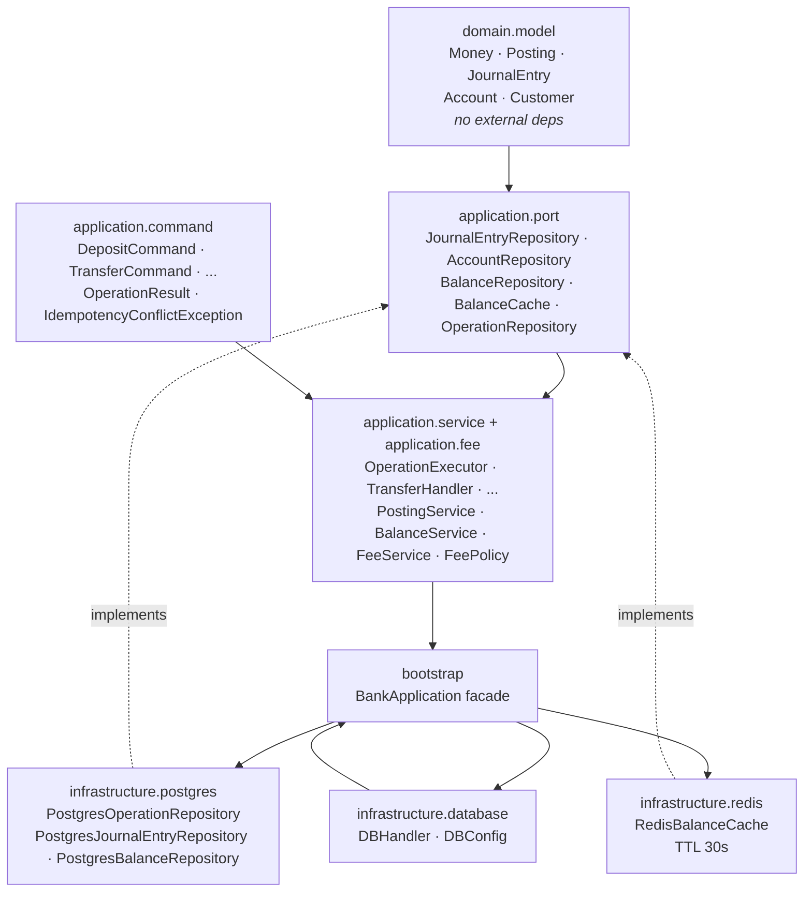
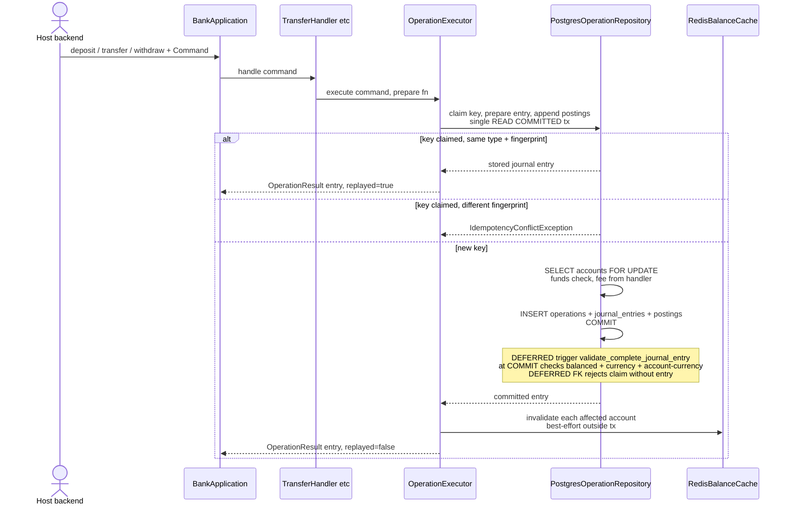
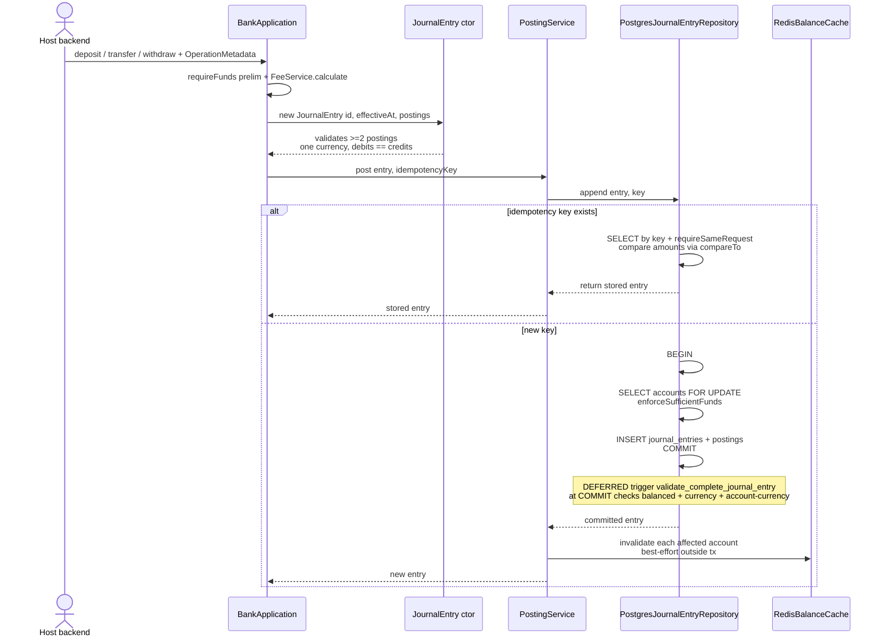
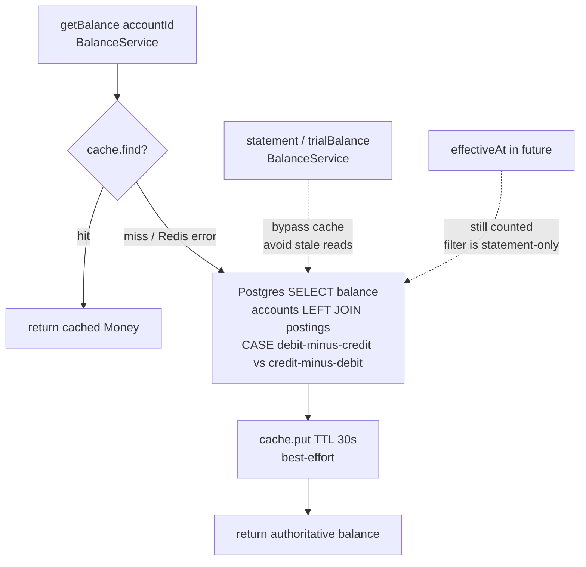

# Architecture

[Documentation home](../README.md#documentation) · [Integration](INTEGRATION.md) · [Accounting model](LEDGER.md)

N² Bank Core runs inside its host backend's Java process. The host calls the library; the library talks to PostgreSQL and Redis. It does not run a server or dispatch requests.

## Source map

| Package | Responsibility | Entry point |
| --- | --- | --- |
| `bootstrap` | Compose adapters and services; expose operations and own client lifecycle | [BankApplication](../src/main/java/com/n2bank/bootstrap/BankApplication.java) |
| `domain.model` | Define monetary values, customers, accounts, and valid journal entries | [JournalEntry](../src/main/java/com/n2bank/domain/model/JournalEntry.java) |
| `application.command` | Carry stable operation inputs, request fingerprints, and results | [TransferCommand](../src/main/java/com/n2bank/application/command/TransferCommand.java) |
| `application.service` | Coordinate accounts, customers, posting, balance reads, fee calculation, and command execution | [OperationExecutor](../src/main/java/com/n2bank/application/service/OperationExecutor.java) |
| `application.fee` | Calculate zero, fixed, or percentage fees | [FeePolicy](../src/main/java/com/n2bank/application/fee/FeePolicy.java) |
| `application.port` | Define repository, operation-claim, and cache interfaces | [OperationRepository](../src/main/java/com/n2bank/application/port/OperationRepository.java) |
| `infrastructure.postgres` | Implement persistence, locking, balance queries, and the command transaction | [PostgresOperationRepository](../src/main/java/com/n2bank/infrastructure/postgres/PostgresOperationRepository.java) |
| `infrastructure.redis` | Store, retrieve, expire, and invalidate cached balances | [RedisBalanceCache](../src/main/java/com/n2bank/infrastructure/redis/RedisBalanceCache.java) |
| `infrastructure.database` | Configure and own shared database clients | [DBHandler](../src/main/java/com/n2bank/infrastructure/database/DBHandler.java) |

The domain uses Java types rather than JDBC or Redis clients. Application services depend on port interfaces. The facade explicitly wires the concrete PostgreSQL and Redis adapters; it is not a configurable dependency-injection container.

### Dependency direction

Dependencies point inward — the domain has no outward imports. Wiring flows outward from the facade.

*Reading:* arrows = `depends on / uses`. Concrete adapters implement port interfaces; the facade owns client lifecycle.

## Command posting flow

1. The host builds an immutable command (`DepositCommand`, `TransferCommand`, `WithdrawalCommand`, `ChargeFeeCommand`, `ReversalCommand`). The facade delegates to the matching handler (`DepositHandler`, `TransferHandler`, and so on).
2. The handler prepares postings through a function that `OperationExecutor` runs inside one `PostgresOperationRepository` transaction: claim the idempotency key, prepare the entry, append postings, commit. Account reads and journal writes share that connection.
3. A claimed key with a matching operation type and fingerprint returns the stored entry without recalculating fees or rechecking funds. A different fingerprint throws `IdempotencyConflictException`. A rolled-back claim disappears, so a later attempt can execute.
4. For a new key, the handler validates referenced accounts, calculates fees, locks affected accounts, checks resulting balances, and inserts the `operations` row together with the journal entry and postings.
5. Deferred schema validation checks the complete entry at commit, including posting/account currency agreement, and the deferred foreign key rejects a claim without its journal entry.
6. After commit, the executor invalidates each affected cached balance. A cache error does not change the committed result.

This separation matters: cache invalidation is outside the database transaction, and constructor validation alone cannot establish whether referenced accounts exist.

See [command idempotency and schema upgrade](OPERATIONS.md) for fingerprints, key scope, and migrations.

### Legacy entry-based flow (deprecated)

The deprecated `OperationMetadata` overloads bypass the command layer and post through `PostingService` directly:

1. The facade checks operation-specific inputs, selects a fee policy where applicable, and constructs a journal entry. Transfer, withdrawal, and fee-charge calls also perform a preliminary balance check.
2. The journal entry constructor validates positive postings through `Posting`, one currency, and matching debit and credit totals.
3. `PostingService` calls the repository's `append` method.
4. The PostgreSQL adapter handles the idempotency key. A matching retry returns the stored entry. A new entry locks affected accounts, checks resulting balances, inserts postings, and commits.
5. Deferred schema validation checks the complete entry at commit, including posting/account currency agreement.
6. After append returns, the service invalidates each affected cached balance. A cache error does not change the committed result.

*Cache invalidation never turns a committed entry into a failure; a `Redis` error is written to standard error in `PostingService.post`.*

## Read flow

`getBalance` checks Redis first, then calculates a balance through PostgreSQL on a miss or cache error. Successful database reads are cached on a best-effort basis. Statements and trial balances bypass Redis.

Balances sum persisted postings. The account type determines the normal sign; see [Accounting model](LEDGER.md). The balance query has no effective-date cutoff, so even a future-dated stored entry participates in the current balance.

*`statement()` and `trialBalance()` always hit Postgres; `getBalance()` is the only cached path.*

## Host responsibilities

Initialize one facade before accepting requests, register stable system-account IDs for each supported currency, and stop or drain requests before closing it. Lifecycle synchronization does not drain work already in progress.

The host supplies user identity, authorization, request validation, response mapping, durable operation metadata, and deployment configuration. The library's customer records are accounting data, not login identities.

For direct composition, services can be constructed with alternative port implementations. [NoOpBalanceCache](../src/main/java/com/n2bank/infrastructure/redis/NoOpBalanceCache.java) is available for that path. The standard facade always constructs a Redis client.
