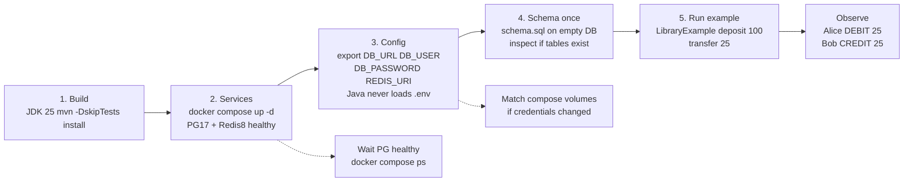
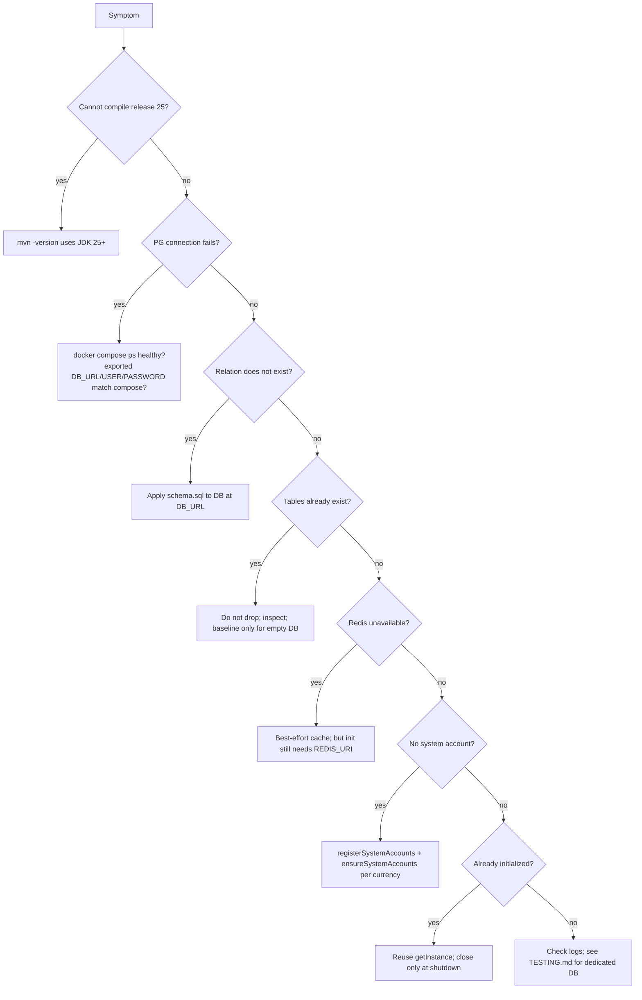

# Getting started

[Documentation home](../README.md#documentation) · [Integration](INTEGRATION.md) · [Testing](TESTING.md)

This walkthrough builds the library and runs a Java caller. It starts no backend server.



## 1. Build

Use JDK 25 or newer, Maven on your PATH, and Docker Compose for local services. From the repository root:

```sh
java -version
mvn -version
mvn -DskipTests install
```

The build targets Java 25. There is no Maven wrapper. Tests are skipped here until a disposable test database has been configured.

To consume the locally installed artifact from another Maven project:

```xml
<dependency>
  <groupId>com.n2bank</groupId>
  <artifactId>n2bank-core</artifactId>
  <version>0.1.0-SNAPSHOT</version>
</dependency>
```

These are the coordinates in [pom.xml](../pom.xml); this guide relies on your local installation of the artifact.

## 2. Start and configure services

```sh
docker compose up -d
docker compose ps
```

The [compose file](../compose.yaml) runs PostgreSQL 17 and Redis 8. Wait for PostgreSQL to be healthy.

Compose reads a root `.env` file when present. [The example file](../.env.example) lists compose and Java settings, but **the Java library does not load `.env`**. Export connection variables or configure them in your IDE.

| Java variable | Default | Meaning |
| --- | --- | --- |
| `DB_URL` | `jdbc:postgresql://localhost:5432/n2bank` | JDBC URL |
| `DB_USER` | `n2bank` | PostgreSQL user |
| `DB_PASSWORD` | `n2bank_local` | PostgreSQL password |
| `DB_MAX_POOL_SIZE` | `10` | Positive maximum connection count |
| `REDIS_URI` | `redis://localhost:6379` | Redis connection URI |

These defaults come from [DBConfig](../src/main/java/com/n2bank/infrastructure/database/DBConfig.java). Match Java settings to compose's `POSTGRES_DB`, `POSTGRES_USER`, `POSTGRES_PASSWORD`, and exposed ports if customized. Changing compose credentials does not rewrite credentials in an already initialized database volume.

PowerShell example:

```powershell
$env:DB_URL = "jdbc:postgresql://localhost:5432/n2bank"
$env:DB_USER = "n2bank"
$env:DB_PASSWORD = "<your configured local password>"
$env:REDIS_URI = "redis://localhost:6379"
```

Replace the password with the actual configured value. On POSIX shells, use `export` for the same variables.

## 3. Apply the schema once

For a new, empty database using the compose defaults:

```sh
docker compose cp database/schema.sql postgres:/tmp/n2bank-schema.sql
docker compose exec -T postgres psql -U n2bank -d n2bank -v ON_ERROR_STOP=1 -f /tmp/n2bank-schema.sql
```

Substitute the database/user if customized. This baseline creates tables and functions; it is not an upgrade script. If tables already exist, inspect the database rather than dropping it. Databases created before the `operations` table existed instead apply the manual scripts in `database/migrations/` — see [schema installation](OPERATIONS.md#schema-installation).

## 4. Run the example

[LibraryExample.java](examples/LibraryExample.java) creates two customer accounts, records a EUR 100.00 deposit, then transfers EUR 25.00 without fees.

```sh
mvn -DskipTests package dependency:copy-dependencies -DincludeScope=runtime
```

Windows:

```powershell
java --class-path "target/classes;target/dependency/*" docs/examples/LibraryExample.java
```

macOS/Linux:

```sh
java --class-path "target/classes:target/dependency/*" docs/examples/LibraryExample.java
```

Expected application output, alongside any client logs:

```text
N² Bank Core — library example
Alice DEBIT EUR 25.00
Bob CREDIT EUR 25.00
```

The example writes to the configured database. Each run creates new customers/accounts and operation keys; its two system-account IDs stay fixed. A backend retains the initialized facade for its full serving lifetime rather than the duration of this example.

## Troubleshooting



| Symptom | Check |
| --- | --- |
| Cannot compile release 25 | Ensure `mvn -version` uses JDK 25 or newer |
| PostgreSQL connection fails | Check service health, port, and exported Java credentials |
| Relation does not exist | Apply the schema to the database in `DB_URL` |
| Tables already exist | The baseline has already been applied or the database is not empty |
| Redis unavailable | Cache access is best effort; client initialization/configuration can still fail startup |
| No system account configured | Register IDs before ensuring accounts or posting operations |
| Application already initialized | Reuse the process-wide instance |

Use [a dedicated database for tests](TESTING.md); the integration suite recreates tables.
