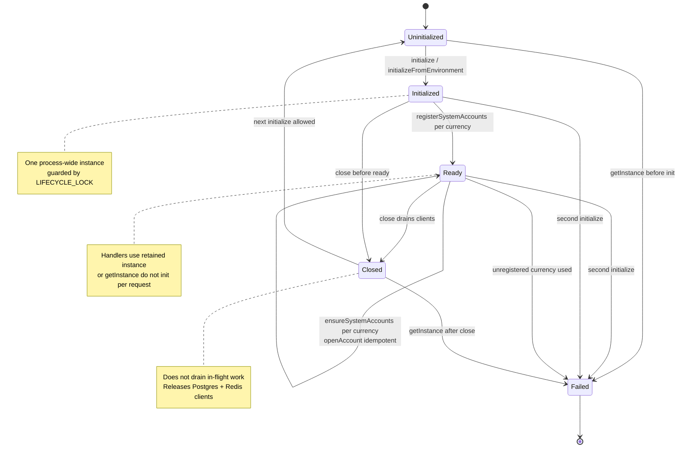
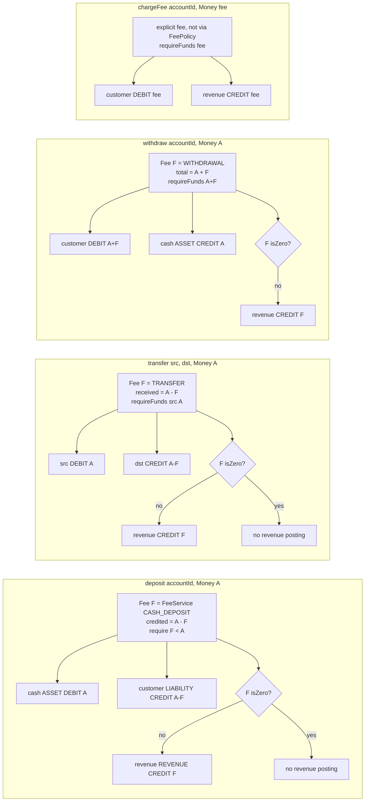
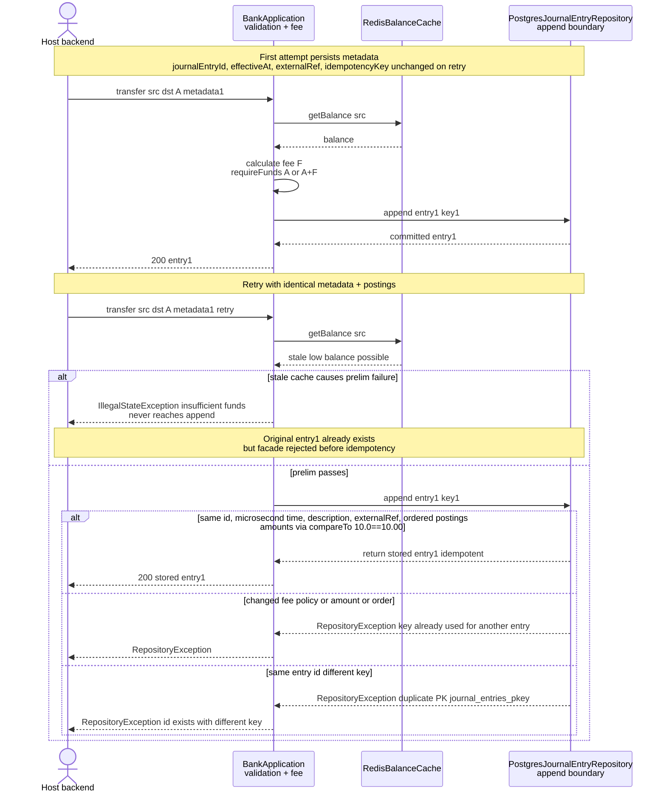

# Integrating with a backend

[Documentation home](../README.md#documentation) · [Setup](GETTING_STARTED.md) · [Complete example](examples/LibraryExample.java)

[BankApplication](../src/main/java/com/n2bank/bootstrap/BankApplication.java) is the facade. The host owns its lifecycle and calls it from application/request handlers.

## Startup and shutdown

Initialize once using `initializeFromEnvironment()` for zero-fee policies, or `initialize(DBConfig, Collection<? extends FeePolicy>)` for explicit policies. A second live initialization throws `IllegalStateException`.

For every supported currency:

1. Choose stable, distinct IDs for bank cash and fee revenue.
2. Call `registerSystemAccounts(currency, cashId, revenueId)`.
3. Call `ensureSystemAccounts(currency, cashName, revenueName)`.

Registration holds an in-memory mapping; repeat it on each startup. It does not itself create or validate database accounts. Deposit, transfer, and withdrawal require a fee-revenue account even with zero fees.

Create customers before owned accounts. Banking operations require owned `LIABILITY` customer accounts; bank cash is an unowned `ASSET` and fee revenue is unowned `REVENUE`. Reusing a customer/account ID with different data fails through the facade.

Handlers can use the retained instance or `getInstance()`. Drain requests before `close()`; closing releases clients and allows later reinitialization. Do not initialize or close per request.

## Operation semantics

Here, A is the requested amount and F is the calculated fee.

| Method | Postings | Behavior |
| --- | --- | --- |
| `deposit` | Cash debit A; customer credit A − F; revenue credit F | A > 0 and F < A |
| `transfer` | Sender debit A; recipient credit A − F; revenue credit F | Distinct customer accounts; A > 0 and F < A |
| `withdraw` | Customer debit A + F; cash credit A; revenue credit F | Requested cash amount excludes the fee |
| `chargeFee` | Customer debit fee; revenue credit fee | Uses the supplied positive amount directly |
| `reverse` | New entry with every direction flipped | Uses the supplied entry; does not load or verify the original |

Zero-fee revenue postings are omitted. Account and amount currencies must agree. These methods record accounting entries; they do not initiate external cash handling or payment-rail transfers.

Reversals undergo ordinary posting checks and can fail if an account would become negative. The original ID appears in the description; there is no dedicated reversal-link constraint or rule preventing multiple reversals under different keys.

## Fees

[FeeService](../src/main/java/com/n2bank/application/service/FeeService.java) permits one policy per type. Duplicate types fail at construction; a missing type fails when calculated.

- `NoFeePolicy`: zero.
- `FixedFeePolicy`: a nonnegative amount in the operation's currency.
- `PercentageFeePolicy`: a decimal rate (`0.01` is 1%) and explicit rounding mode; the result is rounded to the currency's default fraction digits.

`MONTHLY_ACCOUNT` exists as a fee type, but no monthly scheduling workflow is implemented. `chargeFee` takes an explicit amount and does not select a policy.

## Retry semantics

Retain operation metadata before the first attempt: journal entry ID, effective timestamp, optional external reference, and idempotency key. Reuse unchanged inputs and metadata on a retry.

At the **repository append boundary**, a matching key and entry return the stored entry. Comparison includes ID, timestamp at microsecond precision, description, external reference, and ordered postings. Amounts compare numerically, so `10.0` and `10.00` match.

At the **facade boundary**, validation and fee calculation precede append. A transfer of the full available balance may fail its preliminary funds check on replay before reaching repository idempotency. Changed fee policies can also change the generated entry. This is not a complete API-level replay system.

Keys are unique across the whole journal, not per customer or operation. External references are descriptive, not unique. The host decides how to retain operation outcomes and resolve uncertain responses.

*At the **repository append boundary** comparison is numeric; at the **facade boundary** fee policy may have changed. Retain full metadata before the first call.*

## Reads

| Method | Result |
| --- | --- |
| `getAccount(id)` | Required account; missing IDs throw |
| `getBalance(id)` | Normal balance, potentially cached |
| `statement(id, from, to)` | Complete entries affecting the account within inclusive effective-time bounds |
| `trialBalance()` | Totals by account type/currency, keyed like `ASSET:EUR` |

Statements and trial balances bypass Redis. Statements include counterparties' postings, not just the selected account's lines; account for this when authorizing and exposing responses.

## Errors

Invalid inputs generally raise `IllegalArgumentException`; lifecycle/configuration misuse and facade funds checks raise `IllegalStateException`. Persistence failures and repository funds/idempotency rejection use [RepositoryException](../src/main/java/com/n2bank/application/port/RepositoryException.java). Null checks can raise `NullPointerException`.

These exceptions are not a stable HTTP error contract. The host maps them to API responses. Cache invalidation failure after append is caught and logged; it does not turn a committed posting into a failure.
