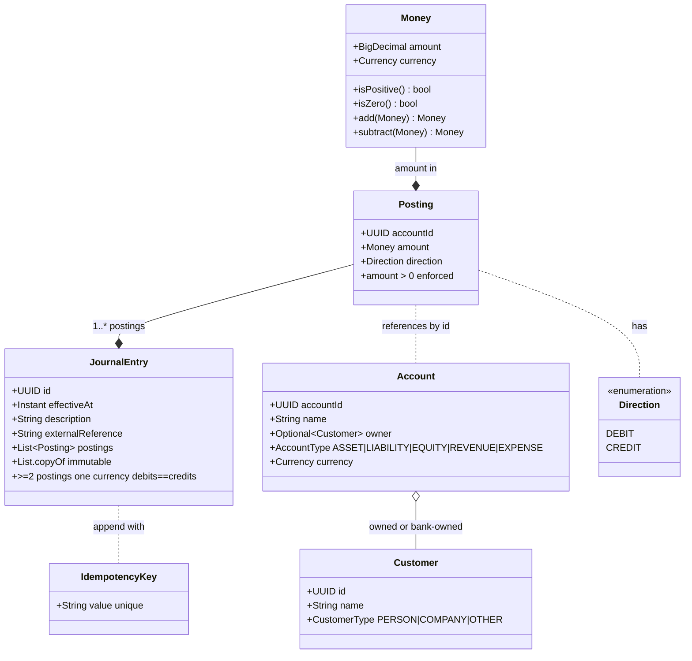
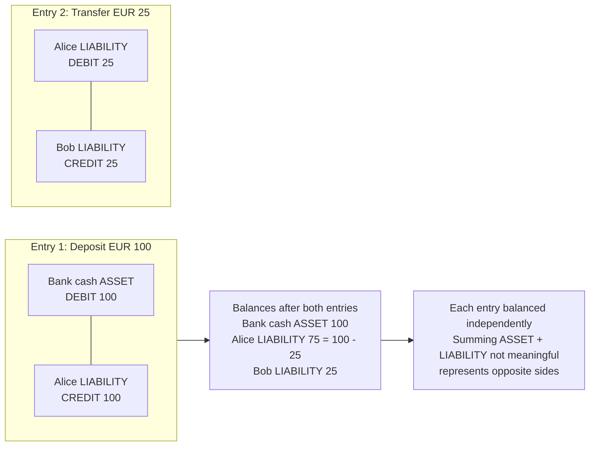
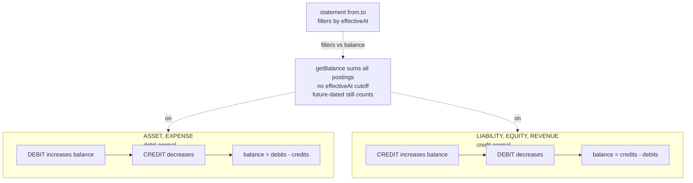
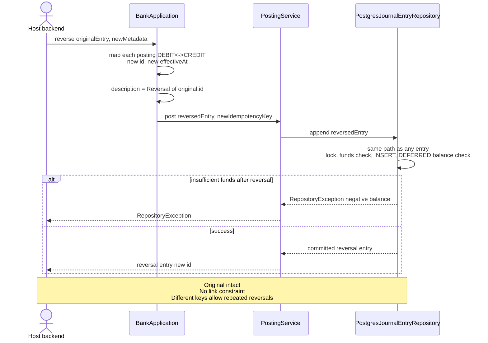

# How the library represents money

[Documentation home](../README.md#documentation) · [Invariants](INVARIANTS.md) · [Architecture](ARCHITECTURE.md)

An account stores identity, ownership, type, and currency. Its balance is calculated from postings rather than stored as a mutable field.

## Values, lines, and entries

[Money](../src/main/java/com/n2bank/domain/model/Money.java) combines a `BigDecimal` amount and `java.util.Currency`. [Posting](../src/main/java/com/n2bank/domain/model/Posting.java) adds an account ID and direction, requiring a positive amount.

[JournalEntry](../src/main/java/com/n2bank/domain/model/JournalEntry.java) groups postings with an ID, effective time, description, and optional external reference. It copies the list and requires at least two postings, one currency, and equal debit/credit totals.

A valid in-memory entry is not yet persisted. Account existence, account currency, funds checks, and commit are handled during persistence.

## Deposit, then transfer

Alice deposits EUR 100.00 and transfers EUR 25.00 to Bob, with zero fees:

| Entry | Account | Debit | Credit |
| --- | --- | ---: | ---: |
| Deposit | Bank cash asset | 100.00 | — |
| Deposit | Alice liability | — | 100.00 |
| Transfer | Alice liability | 25.00 | — |
| Transfer | Bob liability | — | 25.00 |

Balances are EUR 100.00 cash, EUR 75.00 owed to Alice, and EUR 25.00 owed to Bob. Each entry balances independently. Asset and liability balances represent opposite sides of the accounting relationship; adding them together does not measure newly created money.

## Balance signs

| Account type | Normal balance |
| --- | --- |
| ASSET, EXPENSE | Debits minus credits |
| LIABILITY, EQUITY, REVENUE | Credits minus debits |

Customer operations use owned liability accounts: credits increase the amount owed to a customer and debits decrease it.

Current balance queries include every stored posting, even future-dated ones. Effective timestamps support statement filtering; they do not schedule posting or delay its balance effect.

## Precision and equality

Use explicit decimal strings, such as `new Money("12.50", "EUR")`. Arithmetic preserves decimal precision and rejects cross-currency addition/subtraction. `Money` has no conversion API or universal minor-unit rounding rule.

Record equality inherits `BigDecimal.equals` behavior: scale matters. Money values of `10.0` and `10.00` can compare unequal as records. Journal retry comparison instead uses numeric comparison.

PostgreSQL amounts use `NUMERIC(38,18)`, imposing limits not enforced by the Money constructor. Formatting is locale-sensitive; `toString()` is not a stable serialization format.

## Corrections

`reverse(original, metadata)` appends equal amounts with opposite directions and leaves the original intact. It is an accounting reversal helper, not a refund workflow. It does not verify that the original was persisted or prevent repeated reversals under different keys.

