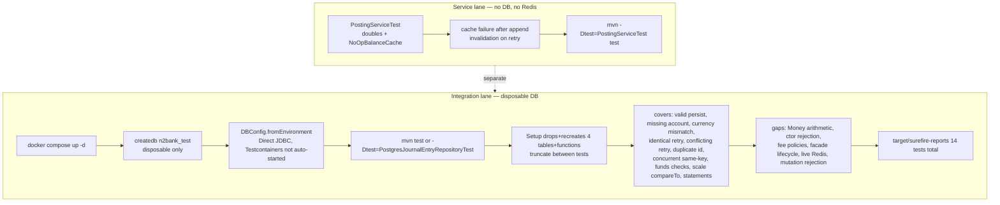

# Testing

[Documentation home](../README.md#documentation) · [Invariants and evidence](INVARIANTS.md)

The suite consists of service tests using doubles and PostgreSQL tests using an external database.



## Service tests without a database

```sh
mvn -Dtest=PostingServiceTest test
```

[PostingServiceTest](../src/test/java/com/n2bank/application/service/PostingServiceTest.java) checks cache failure after append and invalidation on successful retries. It contacts neither PostgreSQL nor Redis.

## Integration tests

**Setup drops and recreates the four library tables and schema functions; tests truncate the tables between cases.** Use a database containing only disposable test data.

Despite a Testcontainers dependency and stale comments, the current test implementation connects directly via `DBConfig.fromEnvironment()`. It does not start a container automatically.

With compose defaults, create a dedicated database once:

```sh
docker compose up -d
docker compose exec -T postgres createdb -U n2bank n2bank_test
```

If it already exists, confirm that it is disposable before using it. The tests install their own schema.

In a separate PowerShell session:

```powershell
$env:DB_URL = "jdbc:postgresql://localhost:5432/n2bank_test"
$env:DB_USER = "n2bank"
$env:DB_PASSWORD = "<your configured local password>"
mvn test
```

Use the actual configured password, user, and port. On POSIX shells, export the same variables. Java does not load compose's `.env`. Close the dedicated shell afterward to avoid using test settings for application work.

For only the database class:

```sh
mvn -Dtest=PostgresJournalEntryRepositoryTest test
```

## Coverage

[PostgresJournalEntryRepositoryTest](../src/test/java/com/n2bank/infrastructure/postgres/PostgresJournalEntryRepositoryTest.java) covers valid persistence, missing-account/currency rejection, matching/conflicting retries, duplicate IDs, concurrent same-key requests, funds checks, decimal-scale comparison, and complete statements.

There are currently 14 tests in total. Reports appear in `target/surefire-reports/`. A passing run supports those scenarios, not a general claim of concurrency safety.

There are no dedicated test classes for money arithmetic, domain constructor rejection, fee policies, facade operations/lifecycle, live Redis, or direct SQL mutation rejection. The test named `unbalancedEntryFailsAndRollsBackPostings` actually submits a balanced entry with a missing account; it does not test unbalanced SQL or failure after partial posting insertion.

The [evidence table](INVARIANTS.md) separates implementation from tested behavior.
