# Testing

[Documentation home](../README.md#documentation) · [Invariants and evidence](INVARIANTS.md)

The suite consists of service tests using doubles and PostgreSQL tests using an external database.

```mermaid
flowchart TD
    subgraph Service["Service lane — no DB, no Redis"]
        S1["PostingServiceTest<br/>doubles + NoOpBalanceCache"] --> S2["cache failure after append<br/>invalidation on retry"]
        S2 --> S3["mvn -Dtest=PostingServiceTest test"]
    end

    subgraph Integration["Integration lane — disposable DB"]
        I1["docker compose up -d"] --> I2["PostgresJournalEntryRepositoryTest<br/>createdb n2bank_test, disposable only"]
        I2 --> I3["DBConfig.fromEnvironment<br/>Direct JDBC, Testcontainers not auto-started"]
        I3 --> I4["mvn test or -Dtest=PostgresJournalEntryRepositoryTest"]
        I4 --> I5["Setup drops+recreates 5 tables+functions<br/>truncate between tests"]
        I5 --> I6["covers: valid persist, missing account, currency mismatch,<br/>identical retry, conflicting retry, duplicate id,<br/>concurrent same-key, funds checks, scale compareTo, statements"]
        I6 --> I7["PostgresOperationRepositoryTest<br/>disposable schema per run, schema.sql loaded"]
        I7 --> I8["N2BANK_TEST_URL USER PASSWORD<br/>covers command replay, conflicts, rollback,<br/>concurrency, reversal, deferred FK"]
        I8 --> I9["DeadlockRetryTest extends that fixture<br/>injects 40P01: retry, exhaustion,<br/>non-retryable errors, interruption"]
        I9 --> I10["BankingLoadTest, same DB vars<br/>per-test disposable schema<br/>1+16 pairs x1000 transfers x3 copies<br/>overspend race, latency report"]
        I10 --> F1["BankApplicationLoadTest<br/>public commands, live Redis, lifecycle,<br/>concurrent transfers and customer journey"]
        F1 --> I11["gaps: Money arithmetic, ctor rejection,<br/>fee policies, cache read/write races, mutation rejection"]
        I11 --> I12["target/surefire-reports 30 methods<br/>39 executions incl reruns + params"]
    end
    Service -. separate .-> Integration
```



## Service tests without a database

```sh
mvn -Dtest=PostingServiceTest test
```

[PostingServiceTest](../src/test/java/com/n2bank/application/service/PostingServiceTest.java) checks cache failure after append and invalidation on successful retries. It contacts neither PostgreSQL nor Redis.

## Integration tests

**Setup drops and recreates the five library tables (`customers`, `accounts`, `journal_entries`, `postings`, `operations`) and schema functions; tests truncate the tables between cases.** Use a database containing only disposable test data.

Despite a Testcontainers dependency and stale comments, the current test implementation connects directly via `DBConfig.fromEnvironment()`. It does not start a container automatically.

With compose defaults, create a dedicated database once:

```sh
docker compose up -d
docker compose exec -T postgres createdb -U n2bank n2bank_test
```

If it already exists, confirm that it is disposable before using it. The tests install their own schema.

In a separate PowerShell session:

```powershell
$env:DB_URL = "jdbc:postgresql://localhost:5432/n2bank_test"
$env:DB_USER = "n2bank"
$env:DB_PASSWORD = "<your configured local password>"
mvn test
```

Use the actual configured password, user, and port. On POSIX shells, export the same variables. Java does not load compose's `.env`. Close the dedicated shell afterward to avoid using test settings for application work.

For only the journal-entry database class:

```sh
mvn -Dtest=PostgresJournalEntryRepositoryTest test
```

## Command operation tests

[PostgresOperationRepositoryTest](../src/test/java/com/n2bank/infrastructure/postgres/PostgresOperationRepositoryTest.java) exercises the command path (`TransferHandler`, `DepositHandler`, `WithdrawalHandler`, `ChargeFeeHandler`, `ReversalHandler` through `OperationExecutor` and `PostgresOperationRepository`). Each run creates a disposable schema (`operations_test_<uuid>`), loads the current `database/schema.sql` into it, and drops the schema afterward — it never touches the application's tables.

Configure its database separately; defaults target the local development database:

```powershell
$env:N2BANK_TEST_URL = "jdbc:postgresql://localhost:5432/n2bank_test"
$env:N2BANK_TEST_USER = "n2bank"
$env:N2BANK_TEST_PASSWORD = "<your configured local password>"
mvn -Dtest=PostgresOperationRepositoryTest test
```

On POSIX shells, export the same variables. The two integration classes intentionally use different variables: `PostgresJournalEntryRepositoryTest` follows `DBConfig` (`DB_URL`/`DB_USER`/`DB_PASSWORD`) and recreates tables in that database, while `PostgresOperationRepositoryTest` uses `N2BANK_TEST_URL`/`N2BANK_TEST_USER`/`N2BANK_TEST_PASSWORD` and isolates itself in a throwaway schema.

## Deadlock retry tests

[DeadlockRetryTest](../src/test/java/com/n2bank/infrastructure/postgres/DeadlockRetryTest.java) extends the operation fixture and injects wrapped `40P01` SQL errors during preparation to verify recovery and commit, exhaustion that leaves the key reusable, non-retryable errors failing on the first attempt, and interruption stopping retries. It uses the same `N2BANK_TEST_*` variables and disposable schema. It does not simulate a real competing-lock deadlock.

```sh
mvn -Dtest=DeadlockRetryTest test
```

## Correctness workload

[BankingLoadTest](../src/test/java/com/n2bank/infrastructure/postgres/BankingLoadTest.java) is a repeatable correctness workload, not a production capacity guarantee. Each test creates its own disposable schema (`load_test_<uuid>`), loads `database/schema.sql`, and drops the schema afterward. It uses the same `N2BANK_TEST_*` variables, sets a 15-second statement timeout, and runs against `TransferHandler` with zero fees:

- `transfersAndDuplicatesPreserveEveryBalance` (parameterized over 1 and 16 account pairs) submits 1,000 unique €1 transfers 3 times each, shuffled with a fixed seed, across 16 workers. It asserts exactly one commit per key, identical entry IDs across duplicates, exact per-account balances, ledger row counts, and per-entry balance, then prints a `BANKING_LOAD` latency report (calls/s, commits/s, p50/p95/p99) to stdout and `target/banking-load-<pairs>-pairs.txt`.
- `competingTransfersCannotOverspendSharedBalance` fires 100 concurrent €3 transfers against a €100 balance and asserts exactly 33 win, losers fail with insufficient funds and leave no claim, and balances end at €1/€99.

Tune the volume without editing code via system properties (defaults shown):

```sh
mvn -Dtest=BankingLoadTest test -Dn2bank.load.workers=16 -Dn2bank.load.pool=8 -Dn2bank.load.transfers=1000 -Dn2bank.load.copies=3 -Dn2bank.load.timeoutSeconds=120
```

## Public library workload and customer journey

[BankApplicationLoadTest](../src/test/java/com/n2bank/bootstrap/BankApplicationLoadTest.java)
uses the same public `BankApplication` entry point a hosting backend calls. Account creation,
funding, transfers, withdrawals, fees, reversals, balances, and statements all go through
the facade. JDBC is used only to install and remove a random `facade_test_<uuid>` schema.
The test requires live PostgreSQL and Redis; it checks Redis connectivity before running.
It removes only cache keys for its own randomly generated account IDs, without flushing Redis.

Use `N2BANK_TEST_URL`, `N2BANK_TEST_USER`, and `N2BANK_TEST_PASSWORD` as above, and
`N2BANK_TEST_REDIS_URI` (default `redis://localhost:6379`). Omit `currentSchema` from the
PostgreSQL URL: the test sets it to its disposable schema. Run this singleton-based test
without parallel test classes that also initialize `BankApplication`.

```sh
mvn -Dtest=BankApplicationLoadTest -Dorg.slf4j.simpleLogger.defaultLogLevel=warn test
```

The customer journey checks all five command types, replay, payload conflicts, sequential
cache invalidation, statements, and replay after closing/reinitializing the application.
The concurrent workload sends 1,000 unique transfers three times each, in both directions
between two funded customers, using 16 workers and 8 database connections. It verifies
1,000 new results and 2,000 replays, identical journal entries for each key, exact final
balances, complete balanced statements, and the trial balance. The same `n2bank.load.*`
properties shown above control volume, workers, pool size, and deadline.

Throughput and p50/p95/p99 call latency are printed and saved to
`target/bank-application-load.txt`. Timing includes the public transfer call and Redis
invalidation; setup and final verification are excluded. Call latency includes database
pool/lock waits, but excludes time waiting in the test executor queue. Calls per second
include replays; commits per second count new transfers only. These are bounded measurements
on the current machine, not maximum production capacity or HTTP endpoint measurements.
The workload checks balances after writes finish; it does not establish cache consistency
for reads racing with writes, Redis outages, process crashes, or multi-process deployment.

## Coverage

[PostgresJournalEntryRepositoryTest](../src/test/java/com/n2bank/infrastructure/postgres/PostgresJournalEntryRepositoryTest.java) covers valid persistence, missing-account/currency rejection, matching/conflicting retries, duplicate IDs, concurrent same-key requests, funds checks, decimal-scale comparison, and complete statements.

[PostgresOperationRepositoryTest](../src/test/java/com/n2bank/infrastructure/postgres/PostgresOperationRepositoryTest.java) covers full-balance replay without fee recalculation, conflicting payloads under one key, claim-plus-journal rollback on insufficient funds, concurrent same-key and different-payload commits, fee posting and replay across all five handlers, reversal of a persisted entry, missing-original rejection without consuming the key, and the deferred claim-without-journal constraint.

[BankingLoadTest](../src/test/java/com/n2bank/infrastructure/postgres/BankingLoadTest.java) covers duplicate submission under concurrency, exact balance preservation, ledger counts, per-entry balance, and overspend races across 1 and 16 account pairs.

There are currently 30 test methods in total (2 service, 12 journal-entry, 8 operation, 4 deadlock-retry, 2 handler workload, 2 public application). `DeadlockRetryTest` inherits the 8 operation fixture tests and the workload's pair test is parameterized, so a full `mvn test` executes 39 including reruns and both pair counts. Reports appear in `target/surefire-reports/`. A passing run supports those scenarios, including the bounded workload — not a production capacity guarantee.

There are no dedicated test classes for money arithmetic, domain constructor rejection, fee policies, or direct SQL mutation rejection. Facade lifecycle and live Redis now have the limited coverage described above. The test named `unbalancedEntryFailsAndRollsBackPostings` actually submits a balanced entry with a missing account; it does not test unbalanced SQL or failure after partial posting insertion.

The [evidence table](INVARIANTS.md) separates implementation from tested behavior.
