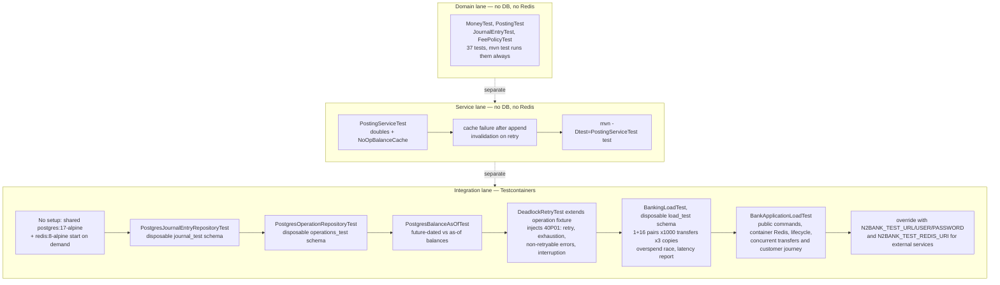

# Testing

[Documentation home](../README.md#documentation) · [Invariants and evidence](INVARIANTS.md)

The suite consists of in-memory domain tests, service tests using doubles, and PostgreSQL/Redis integration tests backed by Testcontainers.


```mermaid
flowchart TD
    subgraph Domain["Domain lane — no DB, no Redis"]
        D1["MoneyTest, PostingTest<br/>JournalEntryTest, FeePolicyTest<br/>37 tests, mvn test runs them always"]
    end

    subgraph Service["Service lane — no DB, no Redis"]
        S1["PostingServiceTest<br/>doubles + NoOpBalanceCache"] --> S2["cache failure after append<br/>invalidation on retry"]
        S2 --> S3["mvn -Dtest=PostingServiceTest test"]
    end

    subgraph Integration["Integration lane — Testcontainers"]
        I1["No setup: shared postgres:17-alpine<br/>+ redis:8-alpine start on demand"] --> I2["PostgresJournalEntryRepositoryTest<br/>disposable journal_test schema"]
        I2 --> I3["PostgresOperationRepositoryTest<br/>disposable operations_test schema"]
        I3 --> I4["PostgresBalanceAsOfTest<br/>future-dated vs as-of balances"]
        I4 --> I5["DeadlockRetryTest extends operation fixture<br/>injects 40P01: retry, exhaustion,<br/>non-retryable errors, interruption"]
        I5 --> I6["BankingLoadTest, disposable load_test schema<br/>1+16 pairs x1000 transfers x3 copies<br/>overspend race, latency report"]
        I6 --> F1["BankApplicationLoadTest<br/>public commands, container Redis, lifecycle,<br/>concurrent transfers and customer journey"]
        F1 --> I7["override with N2BANK_TEST_URL/USER/PASSWORD<br/>and N2BANK_TEST_REDIS_URI for external services"]
    end
    Domain -. separate .-> Service
    Service -. separate .-> Integration
```

## Domain tests without infrastructure

```sh
mvn -Dtest='MoneyTest,PostingTest,JournalEntryTest,FeePolicyTest' test
```

[MoneyTest](../src/test/java/com/n2bank/domain/model/MoneyTest.java) covers null/currency/decimal rejection, cross-currency arithmetic rejection, zero/sign checks, multiplication, whole-divisor splits, scale-sensitive equality, and locale formatting. [PostingTest](../src/test/java/com/n2bank/domain/model/PostingTest.java) covers null and non-positive rejection. [JournalEntryTest](../src/test/java/com/n2bank/domain/model/JournalEntryTest.java) covers null/blank rejection, fewer-than-two, mixed-currency and unbalanced rejection, multi-posting balance, and posting-list immutability. [FeePolicyTest](../src/test/java/com/n2bank/application/fee/FeePolicyTest.java) covers fixed/percentage/no-fee calculation, currency mismatch, negative inputs, rounding modes, yen scale, and `FeeContext`/`FeeQuote` validation.

## Service tests without a database

```sh
mvn -Dtest=PostingServiceTest test
```

[PostingServiceTest](../src/test/java/com/n2bank/application/service/PostingServiceTest.java) checks cache failure after append and invalidation on successful retries. It contacts neither PostgreSQL nor Redis.

## Integration tests

**Each class runs in its own disposable schema and drops it afterward; your databases are never touched.** With Docker running, no setup is needed: [PostgresContainerSupport](../src/test/java/com/n2bank/testsupport/PostgresContainerSupport.java) starts a shared `postgres:17-alpine` container once per JVM (and [RedisContainerSupport](../src/test/java/com/n2bank/testsupport/RedisContainerSupport.java) a shared `redis:8-alpine` for the facade workload), so a clean clone only needs:

```sh
mvn test
```

To reuse external services instead (e.g. the compose stack), set:

```powershell
$env:N2BANK_TEST_URL = "jdbc:postgresql://localhost:5432/n2bank"
$env:N2BANK_TEST_USER = "n2bank"
$env:N2BANK_TEST_PASSWORD = "<your configured local password>"
$env:N2BANK_TEST_REDIS_URI = "redis://localhost:6379"
mvn test
```

On POSIX shells, export the same variables. Java does not load compose's `.env`.

> Windows note: if the container engine is unreachable from the JVM (Docker Desktop npipe quirks), the run fails fast with `Could not find a valid Docker environment`. Use the external-service variables above, or expose the daemon on TCP and set `DOCKER_HOST`.

For only the journal-entry database class:

```sh
mvn -Dtest=PostgresJournalEntryRepositoryTest test
```

## Continuous integration

[ci.yml](../.github/workflows/ci.yml) runs on every push and pull request with PostgreSQL/Redis service containers and Temurin JDK 25. It executes `mvn -B -Dtest='!BankingLoadTest,!BankApplicationLoadTest' test` (75 tests, no load workloads) and uploads `target/surefire-reports`. Run the excluded workloads locally or on demand with a full `mvn test`.

## Command operation tests

[PostgresOperationRepositoryTest](../src/test/java/com/n2bank/infrastructure/postgres/PostgresOperationRepositoryTest.java) exercises the command path (`TransferHandler`, `DepositHandler`, `WithdrawalHandler`, `ChargeFeeHandler`, `ReversalHandler` through `OperationExecutor` and `PostgresOperationRepository`). Each run creates a disposable schema (`operations_test_<uuid>`), loads the current `database/schema.sql` into it, and drops the schema afterward — it never touches the application's tables. Connection coordinates come from `PostgresContainerSupport` (container by default, `N2BANK_TEST_*` override):

```powershell
$env:N2BANK_TEST_URL = "jdbc:postgresql://localhost:5432/n2bank_test"
$env:N2BANK_TEST_USER = "n2bank"
$env:N2BANK_TEST_PASSWORD = "<your configured local password>"
mvn -Dtest=PostgresOperationRepositoryTest test
```

On POSIX shells, export the same variables. All integration classes share the same resolution: container by default, `N2BANK_TEST_URL`/`N2BANK_TEST_USER`/`N2BANK_TEST_PASSWORD` override when explicitly set.

## Deadlock retry tests

[DeadlockRetryTest](../src/test/java/com/n2bank/infrastructure/postgres/DeadlockRetryTest.java) extends the operation fixture and injects wrapped `40P01` SQL errors during preparation to verify recovery and commit, exhaustion that leaves the key reusable, non-retryable errors failing on the first attempt, and interruption stopping retries. It resolves its database the same way and uses a disposable schema. It does not simulate a real competing-lock deadlock.

```sh
mvn -Dtest=DeadlockRetryTest test
```

## Correctness workload

[BankingLoadTest](../src/test/java/com/n2bank/infrastructure/postgres/BankingLoadTest.java) is a repeatable correctness workload, not a production capacity guarantee. Each test creates its own disposable schema (`load_test_<uuid>`), loads `database/schema.sql`, and drops the schema afterward. It resolves its database via `PostgresContainerSupport`, sets a 15-second statement timeout, and runs against `TransferHandler` with zero fees:

- `transfersAndDuplicatesPreserveEveryBalance` (parameterized over 1 and 16 account pairs) submits 1,000 unique €1 transfers 3 times each, shuffled with a fixed seed, across 16 workers. It asserts exactly one commit per key, identical entry IDs across duplicates, exact per-account balances, ledger row counts, and per-entry balance, then prints a `BANKING_LOAD` latency report (calls/s, commits/s, p50/p95/p99) to stdout and `target/banking-load-<pairs>-pairs.txt`.
- `competingTransfersCannotOverspendSharedBalance` fires 100 concurrent €3 transfers against a €100 balance and asserts exactly 33 win, losers fail with insufficient funds and leave no claim, and balances end at €1/€99.

Tune the volume without editing code via system properties (defaults shown):

```sh
mvn -Dtest=BankingLoadTest test -Dn2bank.load.workers=16 -Dn2bank.load.pool=8 -Dn2bank.load.transfers=1000 -Dn2bank.load.copies=3 -Dn2bank.load.timeoutSeconds=120
```

## Public library workload and customer journey

[BankApplicationLoadTest](../src/test/java/com/n2bank/bootstrap/BankApplicationLoadTest.java)
uses the same public `BankApplication` entry point a hosting backend calls. Account creation,
funding, transfers, withdrawals, fees, reversals, balances, and statements all go through
the facade. JDBC is used only to install and remove a random `facade_test_<uuid>` schema.
PostgreSQL and Redis resolve via the Testcontainers supports (external `N2BANK_TEST_*` override
as above); the test checks Redis connectivity before running.
It removes only cache keys for its own randomly generated account IDs, without flushing Redis.

Use `N2BANK_TEST_URL`, `N2BANK_TEST_USER`, and `N2BANK_TEST_PASSWORD` as above to point at
an external database, and `N2BANK_TEST_REDIS_URI` for an external Redis; unset, both resolve to
Testcontainers. Omit `currentSchema` from an external PostgreSQL URL: the test sets it to its disposable schema. Run this singleton-based test
without parallel test classes that also initialize `BankApplication`.

```sh
mvn -Dtest=BankApplicationLoadTest -Dorg.slf4j.simpleLogger.defaultLogLevel=warn test
```

The customer journey checks all five command types, replay, payload conflicts, sequential
cache invalidation, statements, and replay after closing/reinitializing the application.
The concurrent workload sends 1,000 unique transfers three times each, in both directions
between two funded customers, using 16 workers and 8 database connections. It verifies
1,000 new results and 2,000 replays, identical journal entries for each key, exact final
balances, complete balanced statements, and the trial balance. The same `n2bank.load.*`
properties shown above control volume, workers, pool size, and deadline.

Throughput and p50/p95/p99 call latency are printed and saved to
`target/bank-application-load.txt`. Timing includes the public transfer call and Redis
invalidation; setup and final verification are excluded. Call latency includes database
pool/lock waits, but excludes time waiting in the test executor queue. Calls per second
include replays; commits per second count new transfers only. These are bounded measurements
on the current machine, not maximum production capacity or HTTP endpoint measurements.
The workload checks balances after writes finish; it does not establish cache consistency
for reads racing with writes, Redis outages, process crashes, or multi-process deployment.

## Coverage

[PostgresJournalEntryRepositoryTest](../src/test/java/com/n2bank/infrastructure/postgres/PostgresJournalEntryRepositoryTest.java) covers valid persistence, missing-account/currency rejection, matching/conflicting retries, duplicate IDs, concurrent same-key requests, funds checks, decimal-scale comparison, and complete statements.

[PostgresBalanceAsOfTest](../src/test/java/com/n2bank/infrastructure/postgres/PostgresBalanceAsOfTest.java) covers future-dated inclusion in the current balance, exclusion from as-of balances and statement windows, service parity, and null/missing-account rejection.

[PostgresOperationRepositoryTest](../src/test/java/com/n2bank/infrastructure/postgres/PostgresOperationRepositoryTest.java) covers full-balance replay without fee recalculation, conflicting payloads under one key, claim-plus-journal rollback on insufficient funds, concurrent same-key and different-payload commits, fee posting and replay across all five handlers, reversal of a persisted entry, missing-original rejection without consuming the key, and the deferred claim-without-journal constraint.

[BankingLoadTest](../src/test/java/com/n2bank/infrastructure/postgres/BankingLoadTest.java) covers duplicate submission under concurrency, exact balance preservation, ledger counts, per-entry balance, and overspend races across 1 and 16 account pairs.

A full `mvn test` executes 80 tests: 37 domain, 2 service, 12 journal-entry, 4 as-of balance, 8 operation, 12 deadlock-retry (inherited fixture included), 3 handler workload, 2 public application. Reports appear in `target/surefire-reports/`. CI runs 75 of them, excluding the two load workloads. A passing run supports those scenarios, including the bounded workload — not a production capacity guarantee.

Remaining gaps: direct SQL mutation/late-insert rejection, cache read/write races, and lock-order verification. The test named `unbalancedEntryFailsAndRollsBackPostings` actually submits a balanced entry with a missing account; it does not test unbalanced SQL or failure after partial posting insertion.

The [evidence table](INVARIANTS.md) separates implementation from tested behavior.
